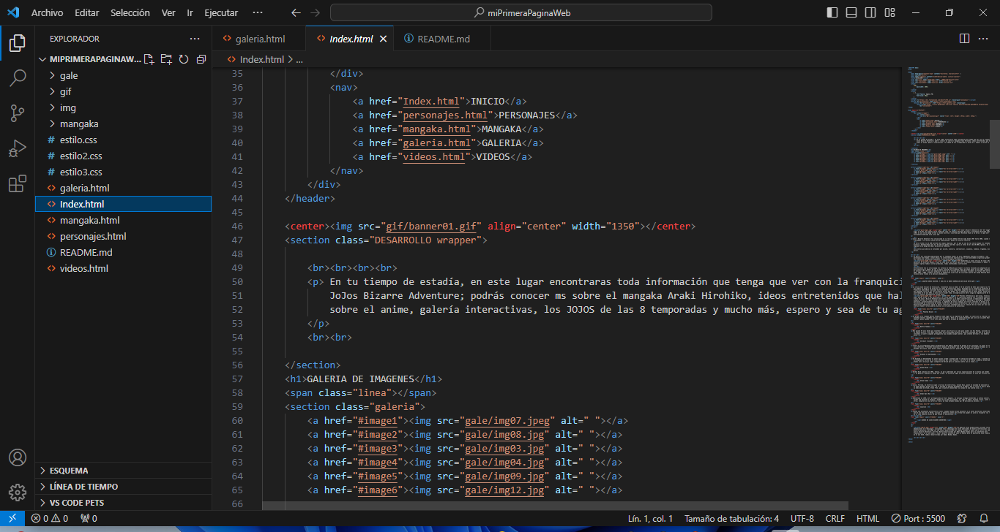
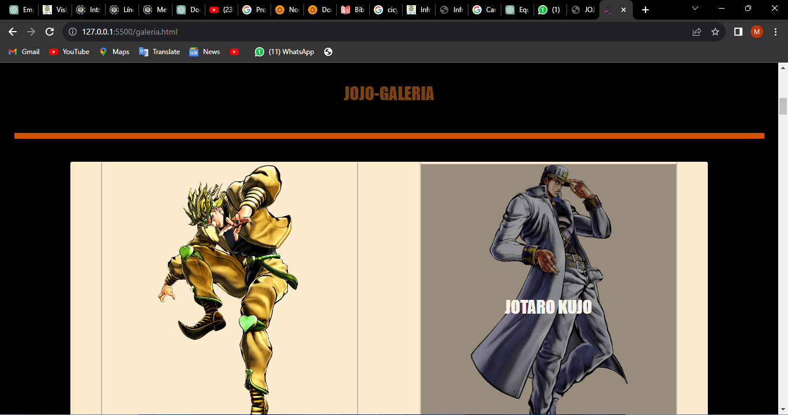

# Página Web sobre Jojos

Este proyecto consiste en una página web dedicada al universo de Jojos, ofreciendo información detallada sobre la serie, sus personajes, historia y curiosidades, involucrando los aprendizajes obtenidos durante las clases del curso de TECNOLOCHICAS PRO.

## Uso

Para acceder al contenido de la página, simplemente abre el archivo `index.html` en tu navegador web preferido.

## Capturas de Pantalla

## Tecnologías Utilizadas

- HTML5
- CSS3

## Contribuciones

¡Las contribuciones son bienvenidas! Si tienes sugerencias, correcciones o mejoras para este proyecto, por favor abre un issue o envía una solicitud de pull.

## Autor

- Nombre:   Melva Santos Bosada
- Contacto: msantosbosada14@gmail.com
© 2023 Melva Santos | Miau Miau | (Programa Technolochicas PRO)
